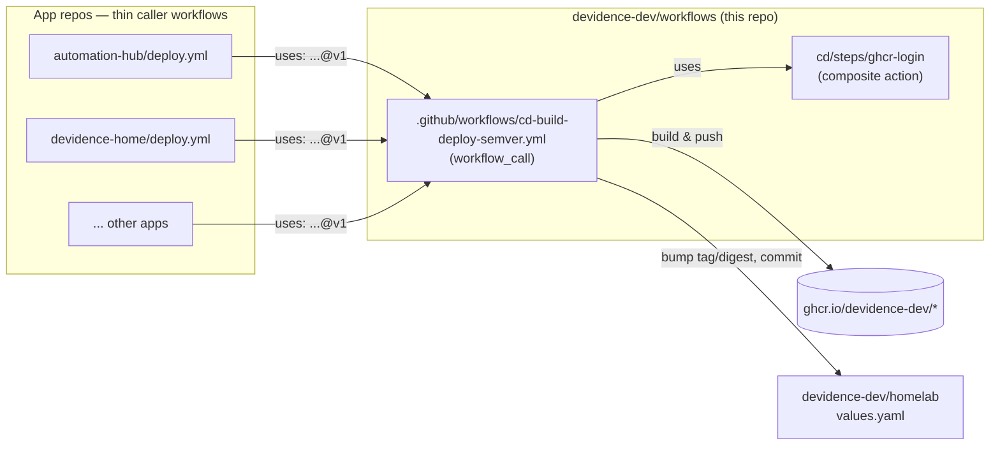
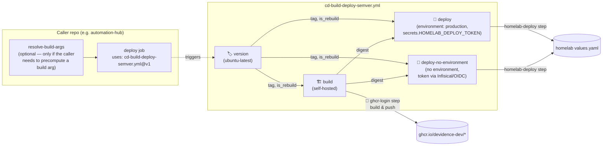
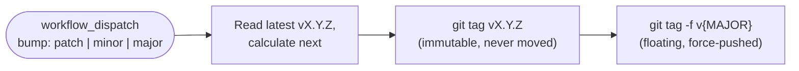
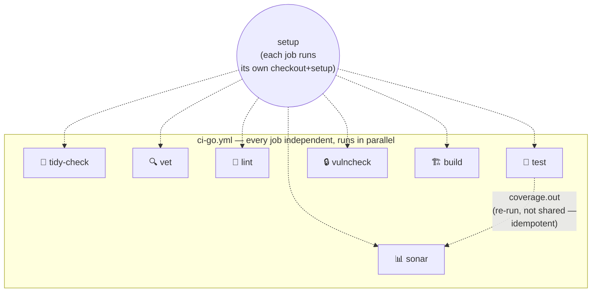

# 🔁 workflows

Reusable GitHub Actions workflows and composite actions for `devidence-dev`'s apps CI/CD
pipelines.

## 🤔 Why this repo exists

Each internal app (`automation-hub`, `devidence-home`, `discord-tts-bot`, and a few others — some
public, some private) used to carry its own hand-copied `deploy.yml` (~200 lines): calculate a semver
tag, build & push the image to GHCR, then bump `tag`/`digest` in
[`homelab`](https://github.com/devidence-dev/homelab)'s `values.yaml`. Porting a single behavior
change across all of them meant editing YAML by hand in every repo — slow, and copies drift (each
repo ends up with its own subtly different `sed`, its own way of fetching secrets, etc).

This repo centralizes that pipeline logic once, the same way
[`devidence-dev/images`](https://github.com/devidence-dev/images) centralized GHCR retention
instead of duplicating a `prune.yml` per repo. Apps keep a thin *caller* workflow (~15 lines) that
invokes the reusable workflow here — a fix or a new feature is written once and adopted by every
caller automatically (see [Versioning](#-versioning) below).

## 🗺️ How it fits together

## 📦 What's here

| Path | Type | Purpose |
|---|---|---|
| `.github/workflows/cd-build-deploy-semver.yml` | Reusable workflow (`workflow_call`) | version → build & push → deploy pipeline for semver-versioned apps |
| `.github/workflows/cd-build-deploy-manual-version.yml` | Reusable workflow (`workflow_call`) | build & push → deploy pipeline for apps with a manual version input (no semver, no git tags) |
| `.github/workflows/release.yml` | Workflow (`workflow_dispatch`) | Tags a new release of *this* repo (see Versioning) |
| `.github/workflows/ci-actionlint.yml` | Workflow (`push`/`pull_request`) | Lints every workflow file here with [`actionlint`](https://github.com/rhysd/actionlint) |
| `.github/workflows/ci-go.yml` | Reusable workflow (`workflow_call`) | Standard Go CI: tidy-check, vet, lint, test, govulncheck, build, Sonar — one independent job each |
| `.github/workflows/ci-node.yml` | Reusable workflow (`workflow_call`) | Node CI: lint, type-check, test, build — each toggleable, since Node repos here vary more than Go ones |
| `.github/workflows/ci-python.yml` | Reusable workflow (`workflow_call`) | Python CI: ruff (lint+format, blocking), pytest, Sonar |
| `cd/steps/ghcr-login/` | Composite action | Fetches `GHCR_TOKEN` from Infisical (OIDC) and logs Docker into `ghcr.io` |
| `cd/steps/homelab-deploy/` | Composite action | Clones `homelab`, updates `tag`/`digest` in the app's `values.yaml`, commits+pushes if there's a real change — shared by both `cd-*.yml` workflows |
| `ci/go/steps/{setup,tidy-check,vet,lint,test,vulncheck,build}/` | Composite actions | Building blocks of `ci-go.yml` — independent and idempotent, each assumes `setup` already ran in the same job |
| `ci/node/steps/{setup,lint,check,test,build}/` | Composite actions | Building blocks of `ci-node.yml` — each just runs the repo's own `bun run <script>` |
| `ci/python/steps/{setup,ruff,test}/` | Composite actions | Building blocks of `ci-python.yml` |
| `ci/steps/sonar-scan/` | Composite action | Fetches `SONAR_TOKEN` from Infisical and runs the SonarCloud scan, blocking on the Quality Gate — language-agnostic, shared by every `ci-<lang>.yml` |
| `.github/workflows/ops-github-runner-build-and-deploy.yml` | Workflow (`workflow_dispatch`) | Builds and deploys the `devidence-dev/github-runner` image — see [Host-ops](#-host-ops-github-runner) |
| `.github/workflows/ops-github-runner-check-updates.yml` | Workflow (`schedule` + `workflow_dispatch`) | Scans running pods for outdated images, notifies via Telegram — see [Host-ops](#-host-ops-github-runner) |
| `.github/workflows/ops-github-runner-cleanup.yml` | Workflow (`schedule` + `workflow_dispatch`) | Prunes unused Docker/containerd images on the runner host — see [Host-ops](#-host-ops-github-runner) |

> Workflow files must live flat in `.github/workflows/` — GitHub doesn't scan subdirectories there.
> The `cd-`/`ci-` filename prefix is just a naming convention to group them; composite actions
> (the `steps/`) don't have that restriction and live under their own area (`cd/steps/`, `ci/go/steps/`,
> `ci/steps/`).

## 🧩 Job graph: `cd-build-deploy-semver.yml`

Only `version` and `build` need each other's outputs directly; both `deploy` variants need both
(`tag`/`is_rebuild` to write the right values and commit message, `digest` to actually give ArgoCD
something to sync on a `rebuild` where the tag itself doesn't change). `deploy` and
`deploy-no-environment` are mutually exclusive via `if: inputs.use_production_environment` — GitHub
still lists **both** in the run graph, but the one that doesn't apply shows as `Skipped`, not
failed. Both call the same `cd/steps/homelab-deploy` composite action, so the actual deploy logic
isn't duplicated between them.

## 👁️ Visibility: this repo is public

Deliberately, not by default: a reusable workflow hosted in a **private** repo can only be called
from other **private** repos (GitHub blocks a public caller from consuming a private repo's
reusable workflow — otherwise its public run logs would leak the private workflow's content).
Most of the apps repos this exists to serve (`automation-hub`, `devidence-home`,
`discord-tts-bot`, `LanguageTool`) are themselves public, so this repo has to be public too, or it
can't be called from them at all — confirmed the hard way: `workflow was not found` on every
attempt, regardless of the (correctly configured) org-level Actions access settings, until the
visibility mismatch was found and fixed. A public reusable workflow here is still fine to call from
this org's private repos too — public is consumable by anyone, no Access configuration needed
either way. Nothing sensitive lives in this repo: every secret is fetched at
runtime (Infisical/OIDC or the caller's own `secrets:`), never hardcoded in YAML.

## 🏷️ Versioning

Callers pin to a **floating major tag** (`@v1`), the same convention `actions/checkout@v4` uses —
not to a branch, and not to a full commit SHA (that would defeat the point of a shared,
centrally-updated pipeline).

1. Change is merged to `main`.
2. Someone runs **Release** (`.github/workflows/release.yml`, `workflow_dispatch`) and picks
   `bump: patch | minor | major`.
3. The job reads the latest `vX.Y.Z` tag and calculates the next one.
4. It creates an **immutable** tag `vX.Y.Z` on the current `main` commit — never moved again.
5. It force-moves the **floating** tag `v{MAJOR}` (e.g. `v1`) to that same commit.
6. Every caller's `uses: devidence-dev/workflows/.github/workflows/cd-build-deploy-semver.yml@v1`
   resolves `@v1` fresh on each of *its own* runs — so the next time any app runs its `deploy.yml`,
   it automatically picks up whatever `v1` points to now, with no edits to that app's repo.

A `major` bump creates a **new** floating tag (`v2`) instead of moving `v1` — existing callers stay
on `v1` (and on whatever behavior it had) until someone deliberately updates their `uses:` line to
`@v2`. A breaking change never gets silently pushed onto callers that haven't opted in.

Example of tag state over time:

| Event | `v1.0.0` | `v1.0.1` | `v2.0.0` | `v1` (floating) | `v2` (floating) |
|---|---|---|---|---|---|
| Initial release (`major`) | → commit A | — | — | → A | — |
| Fix (`patch`) | → A (untouched) | → commit B | — | → B | — |
| Breaking change (`major`) | → A | → B | → commit C | → B (untouched) | → C |

`v1.0.0`/`v1.0.1`/`v2.0.0` are permanent — useful for pinning a specific caller to an exact version
(`@v1.0.0` instead of `@v1`) if it ever needs to opt out of following the floating tag.

## ➕ Onboarding an app

1. Add the inputs your app needs to a caller workflow in its own repo (see
   `automation-hub/.github/workflows/deploy.yml` for a working example) — likely in two jobs: one
   to resolve anything the reusable workflow can't compute itself (e.g. reading a `GO_VERSION` file
   for `build_args`), and one that does the actual `uses:` call, `needs:`-ing the first.
2. Point it at `uses: devidence-dev/workflows/.github/workflows/cd-build-deploy-semver.yml@v1`.
3. Decide `use_production_environment` (default `true`):
   - `true` — deploy runs under `environment: production` and needs a `secrets: { HOMELAB_DEPLOY_TOKEN: ${{ secrets.HOMELAB_DEPLOY_TOKEN }} }`
     block (not `secrets: inherit` — least-privilege, and it's what SonarCloud's default ruleset
     expects). Use this only if the app's repo has a **real** `production` Environment with
     protection rules — otherwise the gate is decorative.
   - `false` — no environment; the token is fetched via Infisical/OIDC inside the reusable
     workflow instead, no `secrets:` block needed on the caller at all. Use this for repos without
     a real Environment (can't set one up without GitHub Pro on a private repo) — this org's
     policy is to prefer Infisical over GitHub-native secrets wherever there's no real approval
     gate to preserve, since GitHub secrets can't be viewed/audited after creation.
   - `environment: production` is **not** settable directly on the caller job either way — GitHub
     doesn't allow `environment:` alongside `uses:` (actionlint catches this); it lives inside the
     reusable workflow's two `deploy`/`deploy-no-environment` job variants instead.
4. Set `permissions: { contents: write, id-token: write }` on the caller job — a job calling a
   reusable workflow can restrict permissions but never grant more than what it itself has.

## 🧪 Go CI: `ci-go.yml`

The standard Go CI stack, adopted by `automation-hub` and another internal Go app — both
previously ran their own divergent check sets (one had `golangci-lint` + `osv-scanner` + OWASP
dependency-check; the other had `go mod verify`/tidy + `govulncheck`, no linter). Reconciled to
**one** canonical set instead of per-repo toggle inputs — this repo is meant to be where the
standard lives, not a menu of every variant that ever existed:

- `tidy-check` — `go mod verify` + a `go mod tidy` drift check.
- `vet` — `go vet ./...`.
- `lint` — `golangci-lint`, **blocking** (the old `--issues-exit-code=0` that made findings
  advisory-only was dropped — a linter that can never fail the build isn't gating anything).
- `test` — `go test -race -coverprofile=... ./...`.
- `vulncheck` — `govulncheck` via `go run golang.org/x/vuln/cmd/govulncheck@latest`. Replaces both
  `osv-scanner` and OWASP dependency-check: it's the Go team's own tool, checks whether a
  vulnerable code path is actually *reachable* from the module (not just "a vulnerable version is
  present"), and needs no separate install step or `JAVA_HOME`.
- `build` — cross-compile verification, configurable target/output/GOOS/GOARCH.
- `sonar` — re-runs the `test` step for its own coverage file (idempotent — no artifact hand-off
  needed between jobs), then `ci/steps/sonar-scan`. **Now always blocks on the Quality Gate** —
  one of the two repos already enforced this, the other only uploaded the analysis; standardized
  on enforcing it.

Each of the seven jobs does its own `checkout` + `ci/go/steps/setup` — no job depends on another's
output. A failure in `lint` doesn't hide whether `test` or `vulncheck` passed.

## 🖥️ Host-ops: github-runner

The three `ops-github-runner-*.yml` files are a deliberate exception to "reusable workflow /
composite action" framing above: they're plain workflows (no `workflow_call`) that operate the
single self-hosted runner box itself — nothing else invokes them. They live here for
organizational consistency (one place for this org's Actions plumbing) after
`devidence-dev/github-runner`'s own `.github/workflows/` was retired in favor of this repo
(2026-09-07), reversing an earlier decision to keep `github-runner` out of this migration
(it still isn't onboarded to `cd-build-deploy-*.yml` — `build-and-deploy` keeps its own
hand-rolled build/deploy job, just relocated).

`build-and-deploy` checks out `devidence-dev/github-runner` explicitly (`with: repository:`) to
get its `Dockerfile`, since the workflow no longer lives in that repo.

`check-updates` and `cleanup` are cron-triggered, and both had a real scheduling bug fixed during
the move: `cron: '0 13 */2 * *'` / `'0 8 */3 * *'` looked like "every 2/3 days" but a stepped
day-of-month field actually means "days of the month divisible by N" — that sequence resets at
every month boundary, so it can fire two days in a row right when the month rolls over. A
top-of-the-hour minute (`:00`) also sits in GitHub's most congested scheduler slot, which is
documented to add unpredictable delay. Both are now a **daily** cron at a fixed non-`:00` minute
(`13:15`/`13:45` UTC, ~8:15/8:45 AM GMT-5) gated by a cheap `ubuntu-latest` `should-run` job that
checks `days-since-epoch % N` — an exact, drift-free N-day cadence that still only touches the
self-hosted runner on days it actually has work to do.

## 🗺️ Roadmap: CI, other languages

`ci-go.yml` is done. Still per-repo, not yet centralized: `ci-python.yml` (QuantWarden),
`ci-node.yml` (devidence-home, discord-tts-bot), `ci-java.yml` (LanguageTool) — same shape,
`ci/<lang>/steps/` + the already-shared `ci/steps/sonar-scan`.
