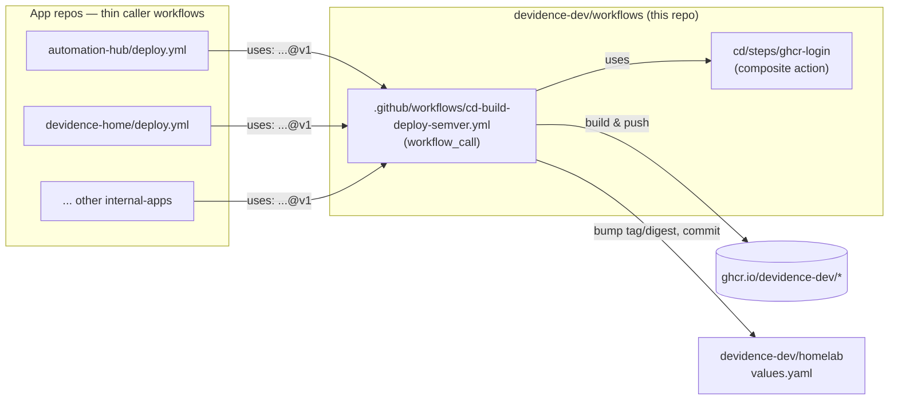

# 🔁 workflows

Reusable GitHub Actions workflows and composite actions for `devidence-dev`'s internal-apps CI/CD
pipelines.

## 🤔 Why this repo exists

Each internal app (`automation-hub`, `devidence-home`, `discord-tts-bot`, `QuantWarden`,
`voraz-bot`, ...) used to carry its own hand-copied `deploy.yml` (~200 lines): calculate a semver
tag, build & push the image to GHCR, then bump `tag`/`digest` in
[`homelab`](https://github.com/devidence-dev/homelab)'s `values.yaml`. Porting a single behavior
change across all of them meant editing YAML by hand in every repo — slow, and copies drift (each
repo ends up with its own subtly different `sed`, its own way of fetching secrets, etc).

This repo centralizes that pipeline logic once, the same way
[`devidence-dev/images`](https://github.com/devidence-dev/images) centralized GHCR retention
instead of duplicating a `prune.yml` per repo. Apps keep a thin *caller* workflow (~15 lines) that
invokes the reusable workflow here — a fix or a new feature is written once and adopted by every
caller automatically (see [Versioning](#-versioning) below).

## 🗺️ How it fits together

## 📦 What's here

| Path | Type | Purpose |
|---|---|---|
| `.github/workflows/cd-build-deploy-semver.yml` | Reusable workflow (`workflow_call`) | version → build & push → deploy pipeline for semver-versioned apps |
| `.github/workflows/release.yml` | Workflow (`workflow_dispatch`) | Tags a new release of *this* repo (see Versioning) |
| `.github/workflows/ci-actionlint.yml` | Workflow (`push`/`pull_request`) | Lints every workflow file here with [`actionlint`](https://github.com/rhysd/actionlint) |
| `cd/steps/ghcr-login/` | Composite action | Fetches `GHCR_TOKEN` from Infisical (OIDC) and logs Docker into `ghcr.io` |

> Workflow files must live flat in `.github/workflows/` — GitHub doesn't scan subdirectories there.
> The `cd-`/`ci-` filename prefix is just a naming convention to group them; composite actions
> (the `steps/`) don't have that restriction and live under their own area (`cd/steps/`, and later
> `ci/<lang>/steps/` once CI pipelines are centralized too).

## 🏷️ Versioning

Callers pin to a **floating major tag** (`@v1`), the same convention `actions/checkout@v4` uses —
not to a branch, and not to a full commit SHA (that would defeat the point of a shared,
centrally-updated pipeline).

1. Change is merged to `main`.
2. Someone runs **Release** (`.github/workflows/release.yml`, `workflow_dispatch`) and picks
   `bump: patch | minor | major`.
3. The job reads the latest `vX.Y.Z` tag and calculates the next one.
4. It creates an **immutable** tag `vX.Y.Z` on the current `main` commit — never moved again.
5. It force-moves the **floating** tag `v{MAJOR}` (e.g. `v1`) to that same commit.
6. Every caller's `uses: devidence-dev/workflows/.github/workflows/cd-build-deploy-semver.yml@v1`
   resolves `@v1` fresh on each of *its own* runs — so the next time any app runs its `deploy.yml`,
   it automatically picks up whatever `v1` points to now, with no edits to that app's repo.

A `major` bump creates a **new** floating tag (`v2`) instead of moving `v1` — existing callers stay
on `v1` (and on whatever behavior it had) until someone deliberately updates their `uses:` line to
`@v2`. A breaking change never gets silently pushed onto callers that haven't opted in.

Example of tag state over time:

| Event | `v1.0.0` | `v1.0.1` | `v2.0.0` | `v1` (floating) | `v2` (floating) |
|---|---|---|---|---|---|
| Initial release (`major`) | → commit A | — | — | → A | — |
| Fix (`patch`) | → A (untouched) | → commit B | — | → B | — |
| Breaking change (`major`) | → A | → B | → commit C | → B (untouched) | → C |

`v1.0.0`/`v1.0.1`/`v2.0.0` are permanent — useful for pinning a specific caller to an exact version
(`@v1.0.0` instead of `@v1`) if it ever needs to opt out of following the floating tag.

## ➕ Onboarding an app

1. Add the inputs your app needs to a caller workflow in its own repo (see
   `automation-hub/.github/workflows/deploy.yml` for a working example).
2. Point it at `uses: devidence-dev/workflows/.github/workflows/cd-build-deploy-semver.yml@v1` with
   `secrets: inherit`.
3. Set `environment: production` on the caller job if your Infisical/OIDC setup needs it (some apps
   deliberately omit this — see the `use_infisical_for_deploy_token` input's description in the
   reusable workflow for why).
