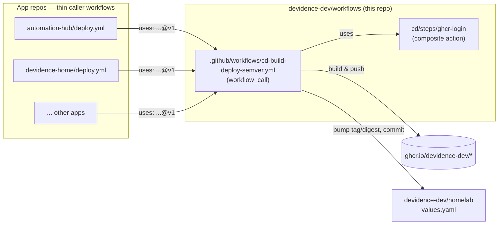
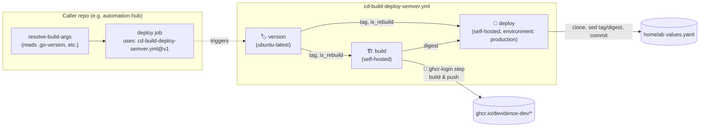

# 🔁 workflows

Reusable GitHub Actions workflows and composite actions for `devidence-dev`'s apps CI/CD
pipelines.

## 🤔 Why this repo exists

Each internal app (`automation-hub`, `devidence-home`, `discord-tts-bot`, and a few others — some
public, some private) used to carry its own hand-copied `deploy.yml` (~200 lines): calculate a semver
tag, build & push the image to GHCR, then bump `tag`/`digest` in
[`homelab`](https://github.com/devidence-dev/homelab)'s `values.yaml`. Porting a single behavior
change across all of them meant editing YAML by hand in every repo — slow, and copies drift (each
repo ends up with its own subtly different `sed`, its own way of fetching secrets, etc).

This repo centralizes that pipeline logic once, the same way
[`devidence-dev/images`](https://github.com/devidence-dev/images) centralized GHCR retention
instead of duplicating a `prune.yml` per repo. Apps keep a thin *caller* workflow (~15 lines) that
invokes the reusable workflow here — a fix or a new feature is written once and adopted by every
caller automatically (see [Versioning](#-versioning) below).

## 🗺️ How it fits together



## 📦 What's here

| Path | Type | Purpose |
|---|---|---|
| `.github/workflows/cd-build-deploy-semver.yml` | Reusable workflow (`workflow_call`) | version → build & push → deploy pipeline for semver-versioned apps |
| `.github/workflows/release.yml` | Workflow (`workflow_dispatch`) | Tags a new release of *this* repo (see Versioning) |
| `.github/workflows/ci-actionlint.yml` | Workflow (`push`/`pull_request`) | Lints every workflow file here with [`actionlint`](https://github.com/rhysd/actionlint) |
| `cd/steps/ghcr-login/` | Composite action | Fetches `GHCR_TOKEN` from Infisical (OIDC) and logs Docker into `ghcr.io` |

> Workflow files must live flat in `.github/workflows/` — GitHub doesn't scan subdirectories there.
> The `cd-`/`ci-` filename prefix is just a naming convention to group them; composite actions
> (the `steps/`) don't have that restriction and live under their own area (`cd/steps/`, and later
> `ci/<lang>/steps/` once CI pipelines are centralized too — see [Roadmap](#-roadmap-ci-phase-2)).

## 🧩 Job graph: `cd-build-deploy-semver.yml`



Only `version` and `build` need each other's outputs directly; `deploy` needs both (`tag`/
`is_rebuild` to write the right values and commit message, `digest` to actually give ArgoCD
something to sync on a `rebuild` where the tag itself doesn't change).

## 👁️ Visibility: this repo is public

Deliberately, not by default: a reusable workflow hosted in a **private** repo can only be called
from other **private** repos (GitHub blocks a public caller from consuming a private repo's
reusable workflow — otherwise its public run logs would leak the private workflow's content).
Most of the apps repos this exists to serve (`automation-hub`, `devidence-home`,
`discord-tts-bot`, `LanguageTool`) are themselves public, so this repo has to be public too, or it
can't be called from them at all — confirmed the hard way: `workflow was not found` on every
attempt, regardless of the (correctly configured) org-level Actions access settings, until the
visibility mismatch was found and fixed. A public reusable workflow here is still fine to call from
this org's private repos too — public is consumable by anyone, no Access configuration needed
either way. Nothing sensitive lives in this repo: every secret is fetched at
runtime (Infisical/OIDC or the caller's own `secrets:`), never hardcoded in YAML.

## 🏷️ Versioning

Callers pin to a **floating major tag** (`@v1`), the same convention `actions/checkout@v4` uses —
not to a branch, and not to a full commit SHA (that would defeat the point of a shared,
centrally-updated pipeline).

1. Change is merged to `main`.
2. Someone runs **Release** (`.github/workflows/release.yml`, `workflow_dispatch`) and picks
   `bump: patch | minor | major`.
3. The job reads the latest `vX.Y.Z` tag and calculates the next one.
4. It creates an **immutable** tag `vX.Y.Z` on the current `main` commit — never moved again.
5. It force-moves the **floating** tag `v{MAJOR}` (e.g. `v1`) to that same commit.
6. Every caller's `uses: devidence-dev/workflows/.github/workflows/cd-build-deploy-semver.yml@v1`
   resolves `@v1` fresh on each of *its own* runs — so the next time any app runs its `deploy.yml`,
   it automatically picks up whatever `v1` points to now, with no edits to that app's repo.


A `major` bump creates a **new** floating tag (`v2`) instead of moving `v1` — existing callers stay
on `v1` (and on whatever behavior it had) until someone deliberately updates their `uses:` line to
`@v2`. A breaking change never gets silently pushed onto callers that haven't opted in.

Example of tag state over time:

| Event | `v1.0.0` | `v1.0.1` | `v2.0.0` | `v1` (floating) | `v2` (floating) |
|---|---|---|---|---|---|
| Initial release (`major`) | → commit A | — | — | → A | — |
| Fix (`patch`) | → A (untouched) | → commit B | — | → B | — |
| Breaking change (`major`) | → A | → B | → commit C | → B (untouched) | → C |

`v1.0.0`/`v1.0.1`/`v2.0.0` are permanent — useful for pinning a specific caller to an exact version
(`@v1.0.0` instead of `@v1`) if it ever needs to opt out of following the floating tag.

## ➕ Onboarding an app

1. Add the inputs your app needs to a caller workflow in its own repo (see
   `automation-hub/.github/workflows/deploy.yml` for a working example) — likely in two jobs: one
   to resolve anything the reusable workflow can't compute itself (e.g. reading a `GO_VERSION` file
   for `build_args`), and one that does the actual `uses:` call, `needs:`-ing the first.
2. Point it at `uses: devidence-dev/workflows/.github/workflows/cd-build-deploy-semver.yml@v1`.
3. Pass secrets **explicitly** (`secrets: { HOMELAB_DEPLOY_TOKEN: ${{ secrets.HOMELAB_DEPLOY_TOKEN }} }`),
   not `secrets: inherit` — least-privilege, and it's what SonarCloud's default ruleset expects.
4. Set `permissions: { contents: write, id-token: write }` on the caller job — a job calling a
   reusable workflow can restrict permissions but never grant more than what it itself has.
5. `environment: production` is **not** settable on the caller job (GitHub doesn't allow
   `environment:` alongside `uses:` — actionlint catches this). It's hardcoded inside the reusable
   workflow's `deploy` job today, since every current caller wants it; a still-private
   multi-container app will need this revisited when it's onboarded (it must *not* run under an
   environment — changes the OIDC `sub` claim and breaks its Infisical machine identity match).

## 🗺️ Roadmap: CI (phase 2)

This repo currently only centralizes CD (`cd-build-deploy-semver.yml`). Each app's own `ci.yml`
(lint/test/vuln-scan) is still per-repo, and — unlike CD — genuinely differs by language, so it'll
need its own reusable workflow per language once centralized:

```
ci/
  go/steps/<name>/action.yml       # e.g. setup (setup-go + cache), test, lint, vuln-scan
  python/steps/<name>/action.yml   # e.g. setup (setup-uv), test
  node/steps/<name>/action.yml     # devidence-home, discord-tts-bot
  java/steps/<name>/action.yml     # LanguageTool
  steps/sonar-scan/action.yml      # NOT per-language — the Infisical+SonarCloud block is identical
                                    # today in every ci.yml regardless of language
.github/workflows/
  ci-go.yml       # workflow_call assembling checkout + ci/go/steps/* + ci/steps/sonar-scan
  ci-python.yml   # same idea for Python
  ...
```

**Decided ahead of building it**: `automation-hub` and another internal Go app have already
diverged — one runs `golangci-lint` + `osv-scanner` + OWASP dependency-check + Sonar; the other
runs `go mod verify` + a tidy check + `govulncheck` + Sonar (lighter, no golangci-lint). `ci-go.yml`
will define **one** canonical Go check set (not per-repo toggle inputs) and both repos adopt it
as-is — simpler to maintain, and consistent with treating this repo as the place standards live,
not a menu of every variant that ever existed.
